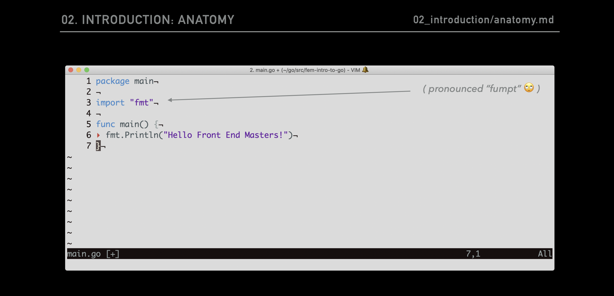
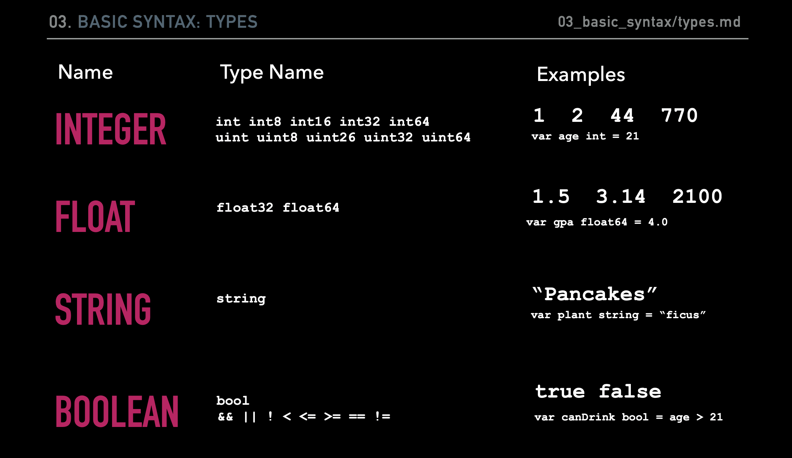
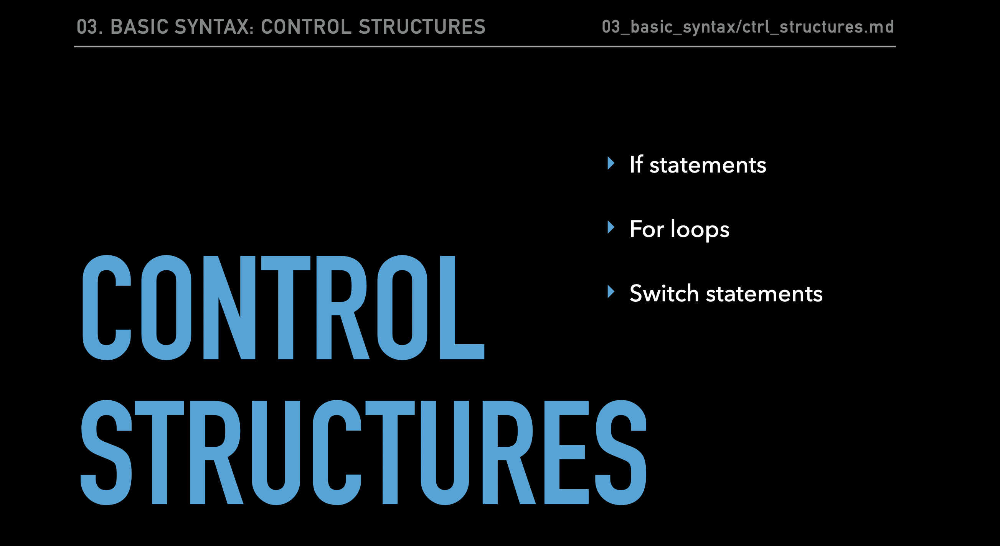
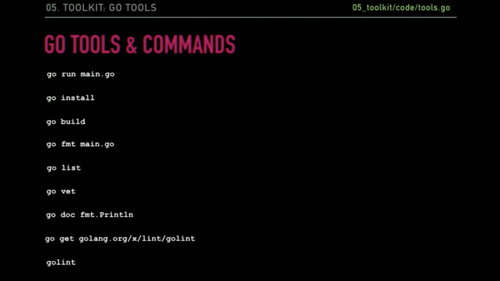

# Summary for Go for JavaScript Developers
Go (also called Golang or Go language) is an open source programming language used for general purpose. Go was developed by Google engineers to create dependable and efficient software. Most similarly modeled after C, Go is statically typed and explicit.

Example code documentation: https://github.com/martensonbj/fem-intro-to-go

## Installation


## Docs
I will not explain much about the documentation because on the official website it is explained in full, you can open it here: https://go.dev/doc/

## GO vs JavaScript Comparison


<table>
    <thead>
        <tr>
            <th>Type</th>
            <th>GO</th>
            <th>JS</th>
        </tr>
    </thead>
    <tbody>
        <tr>
            <td>Typing</td>
            <td>Strongly typed (String, Float, Int, Byte, Struct)</td>
            <td>Dynamically typed (Variables can change )</td>
        </tr>
        <tr>
            <td>Structures</td>
            <td>Structs, Pointers, Methods, Interfaces</td>
            <td>ES6 Classes</td>
        </tr>
        <tr>
            <td>Error Handling</td>
            <td>Explicit</td>
            <td>Built in</td>
        </tr>
        <tr>
            <td>Multi Tasking</td>
            <td>Multi-Threaded (Concurrency, Goroutines, Sync)</td>
            <td>Single-Threaded (Callbacks, async await, sagas, sadness)</td>
        </tr>
        <tr>
            <td>Opiniated-ness</td>
            <td>Strong Opinions (Convention, built in tooling and linters)</td>
            <td>Fluid Opinions (Subjective to the mood that day)</td>
        </tr>
    </tbody>
</table>

## Anatomy of a Go File


We have to import "fmt", so we can print it in console, for example:
```
package main

import "fmt"

func main() {
    fmt.Println("Hello world")
}
```


## Printing

<table>
    <thead>
        <tr>
            <th>Type</th>
            <th>Code</th>
            <th>Description</th>
        </tr>
    </thead>
    <tbody>
        <tr>
            <td rowspan="4">Print</td>
        </tr>
        <tr>
            <td>fmt.Print()</td>
            <td>Prints output to the stdout console</td>
        </tr>
        <tr>
            <td>fmt.Println()</td>
            <td>Returns number of bytes and an error</td>
        </tr>
        <tr>
            <td>fmt.Printf()</td>
            <td>The error is generally not worried about</td>
        </tr>
        <tr>
            <td rowspan="4">Fprint</td>
        </tr>
        <tr>
            <td>fmt.Fprint()</td>
            <td>Prints the output to an external source (file, browser)</td>
        </tr>
        <tr>
            <td>fmt.Fprintln()</td>
            <td>Does not print to the stdout console</td>
        </tr>
        <tr>
            <td>fmt.Fprintf()</td>
            <td>Returns number of bytes, and any write errors</td>
        </tr>
        <tr>
            <td rowspan="4">Sprint</td>
        </tr>
        <tr>
            <td>fmt.Sprint()</td>
            <td>Stores output on a character buffer</td>
        </tr>
        <tr>
            <td>fmt.Sprintln()</td>
            <td>Does not print to stout console</td>
        </tr>
        <tr>
            <td>fmt.Sprintf()</td>
            <td>Returns the string you want to print</td>
    </tbody>
</table>

## Basic GO Syntax
- <a href="https://github.com/martensonbj/fem-intro-to-go/blob/master/03_basic_syntax/types.md">Types</a>


- <a href="https://github.com/martensonbj/fem-intro-to-go/blob/master/03_basic_syntax/variables.md">Variables</a>
- <a href="https://github.com/martensonbj/fem-intro-to-go/blob/master/03_basic_syntax/ctrl_structures.md">Control Structures</a>
  

## Complex Structures

Source: https://github.com/martensonbj/fem-intro-to-go/blob/master/04_complex_structures

### Function
A function is simply a “chunk” of code that you can use over and over again, rather than writing it out multiple times. Functions enable programmers to break down or decompose a problem into smaller chunks, each of which performs a particular task.

Example:
```
func printAge(age int) int {
  fmt.Println(age)
  return age
}
```

### Variadic Functions 
A variadic function is a function that can accept an unlimited number of parameters of the same type, the way to declare a variadic function is to use three dots ( … ) after the variable name.
Example:
```
func printAge(age ...int) int {
  return age
}

func main() int {
  printAge(17, 29, 40)
}

```

### Arrays
Arrays in Go have some significant differences compared to those in JavaScript.

Let's compare notes.

JavaScript:
```
// Initialize an empty array
const grabBag = []
// Eventually this array could have values that represent these types:
const grabBag = [string, int, boolean, float64]
// or
const grabBag = [string, string, string, string, integer, boolean, float64]

```
Go:
```
// Initialize an empty array
var scores [5]float64
// Eventually this array can ONLY contain floats and a length of 5:
[float64, float64, float64, float64, float64]
```

### Slice
A slice is a segment of an array. Like an array, a slice must contain a single type of element. Elements can still be accessed by their index, a slice must start with an initial length, but unlike arrays their lengths can change.

Let's say we have a fixed array that looks like this:

```
fruitArray := [5]string{"banana", "pear", "apple", "kumquat", "peach"}
```

We could access and create a slice of that by specifying two indices from within that array, separated by a colon.

In the following example, we are asking for elements starting at index 1, up to but not including index 3.

```
var splicedFruit []string = fruit[1:3]  // ==> ["pear", "apple",]
```

### Maps
Maps look and behave similarly to Objects in JavaScript, using a set of key value pairs.

A map starts with the keyword map, followed by the key type, and the value type.

```
var userEmails map[int]string
```

Here we are telling Go to create a map called userEmails which will have keys as integers (think IDs), and values as strings that will represent each email address.

As with arrays, we can simplify creating our map using abbreviated syntax. Note that here we don't need the make keyword since we are providing Go with an initial amount of data to store in memory:

```
userEmails := map[int]string{
  1: "user1@gmail.com",
  2: "user2@gmail.com",
}
fmt.Println(userEmails)
```

## Tools & Commands


### Unit Testing
Testing a Method

- Go includes a package, `testing`, that contains all the functions necessary to run a test suite and command to run those tests, `go test`.
- Test file names must end with `_test.go` and the Go compiler will know to ignore these unless `go test` is run.
- The test files need to be in the same package as the method they are testing.
- The test name should start with `Test` followed by the name of the function you are testing.
- The only parameter passed into the test should be` t *testing.T`.
- Note: We will discuss what that `*` means shortly.

```
// average_test.go

package utils

import "testing"

// The test should always accept the same argument, t, of type *testing.T)
func TestAverage(t *testing.T) {
  // the value you expect to get from the tested function
  expected := 4
  actual := utils.average(1, 2, 3)
  if actual != expected {
    t.Errorf("Average was incorrect! Expected: %d, Actual: %d", expected, actual)
  }
}
```
To run tests, use the command go test from within the directory where the test file lives.

`TRY IT Test The Add Function from our math.go file in utils.`

## Struct
A struct is a data type that contains a collection of fields that act as variables, have defined types and is reusable across your program.

Think an ES6 Class in JS, or an object of values without keys.

```
type User struct {
  ID int
  FirstName string
  LastName string
  Email string
}
```
Another way to write this is:

```
type User struct {
  ID int
  FirstName, LastName, Email string
}
```
