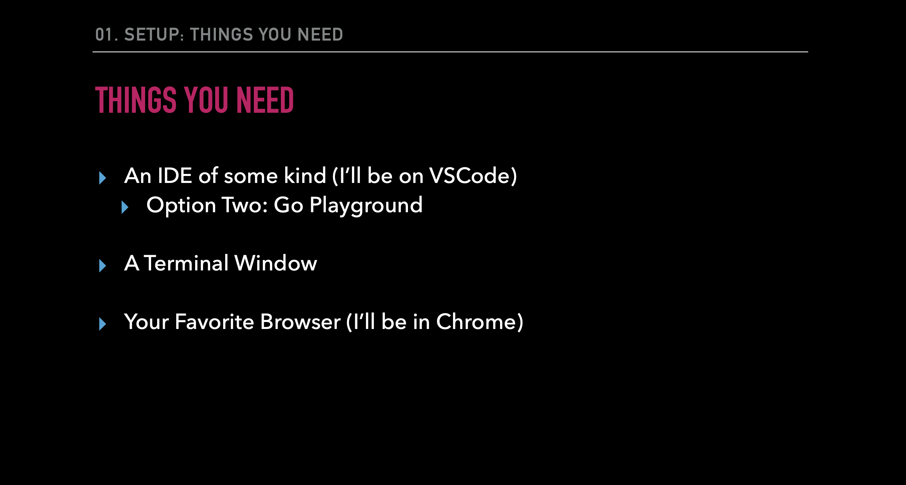
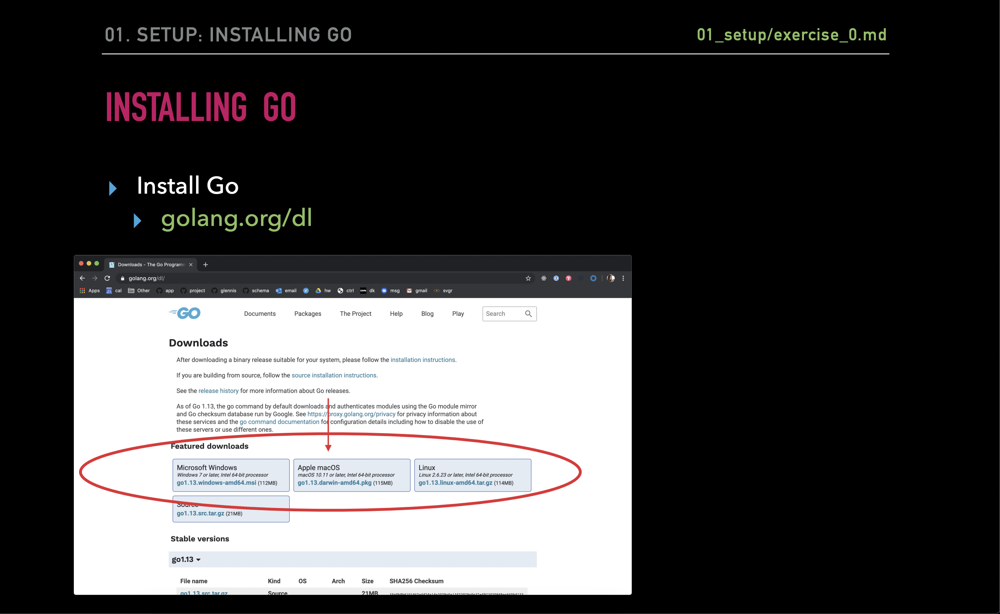
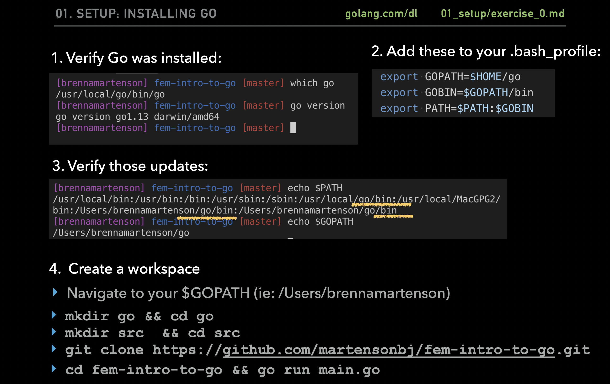
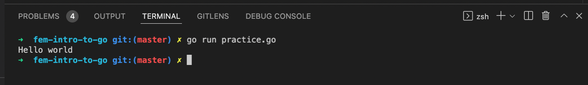

# Summary for Go for JavaScript Developers
Go (also called Golang or Go language) is an open source programming language used for general purpose. Go was developed by Google engineers to create dependable and efficient software. Most similarly modeled after C, Go is statically typed and explicit.


## Installation




## Docs
I will not explain much about the documentation because on the official website it is explained in full, you can open it here: https://go.dev/doc/

## GO vs JavaScript Comparison


<table>
    <thead>
        <tr>
            <th>Type</th>
            <th>GO</th>
            <th>JS</th>
        </tr>
    </thead>
    <tbody>
        <tr>
            <td>Typing</td>
            <td>Strongly typed (String, Float, Int, Byte, Struct)</td>
            <td>Dynamically typed (Variables can change )</td>
        </tr>
        <tr>
            <td>Structures</td>
            <td>Structs, Pointers, Methods, Interfaces</td>
            <td>ES6 Classes</td>
        </tr>
        <tr>
            <td>Error Handling</td>
            <td>Explicit</td>
            <td>Built in</td>
        </tr>
        <tr>
            <td>Multi Tasking</td>
            <td>Multi-Threaded (Concurrency, Goroutines, Sync)</td>
            <td>Single-Threaded (Callbacks, async await, sagas, sadness)</td>
        </tr>
        <tr>
            <td>Opiniated-ness</td>
            <td>Strong Opinions (Convention, built in tooling and linters)</td>
            <td>Fluid Opinions (Subjective to the mood that day)</td>
        </tr>
    </tbody>
</table>

## Anatomy of a Go File
We have to import "fmt", so we can print it in console, for example:
```
package main

import "fmt"

func main() {
    fmt.Println("Hello world")
}
```



### Printing

<table>
    <thead>
        <tr>
            <th>Type</th>
            <th>Code</th>
            <th>Description</th>
        </tr>
    </thead>
    <tbody>
        <tr>
            <td rowspan="4">Print</td>
        </tr>
        <tr>
            <td>fmt.Print()</td>
            <td>Prints output to the stdout console</td>
        </tr>
        <tr>
            <td>fmt.Println()</td>
            <td>Returns number of bytes and an error</td>
        </tr>
        <tr>
            <td>fmt.Printf()</td>
            <td>The error is generally not worried about</td>
        </tr>
        <tr>
            <td rowspan="4">Fprint</td>
        </tr>
        <tr>
            <td>fmt.Fprint()</td>
            <td>Prints the output to an external source (file, browser)</td>
        </tr>
        <tr>
            <td>fmt.Fprintln()</td>
            <td>Does not print to the stdout console</td>
        </tr>
        <tr>
            <td>fmt.Fprintf()</td>
            <td>Returns number of bytes, and any write errors</td>
        </tr>
        <tr>
            <td rowspan="4">Sprint</td>
        </tr>
        <tr>
            <td>fmt.Sprint()</td>
            <td>Stores output on a character buffer</td>
        </tr>
        <tr>
            <td>fmt.Sprintln()</td>
            <td>Does not print to stout console</td>
        </tr>
        <tr>
            <td>fmt.Sprintf()</td>
            <td>Returns the string you want to print</td>
        </tr>
    </tbody>
</table>